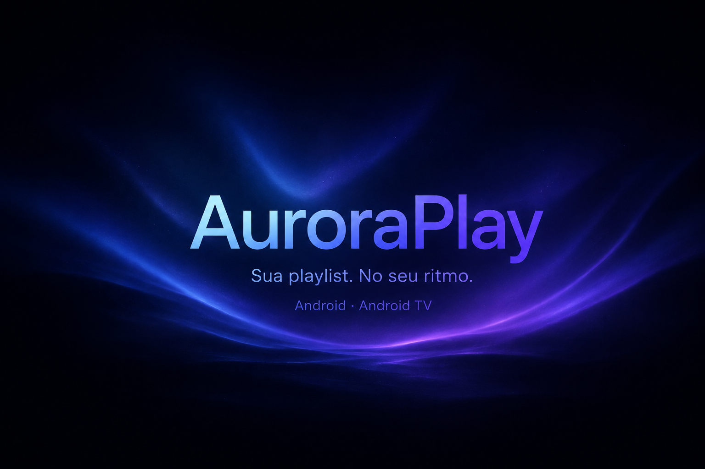

<div align="center">

<a href="https://lhzin0.github.io/auroraplay/">
    
</a>

# AuroraPlay

Reprodutor IPTV/Xtream para Android e Android TV

[](https://lhzin0.github.io/auroraplay/)
[](https://github.com/lhzin0/auroraplay/actions/workflows/ci.yml)
[](https://github.com/lhzin0/auroraplay/actions/workflows/codeql.yml)
[](./LICENSE)



## Download

[](https://github.com/lhzin0/auroraplay/releases)

*Requer Android 7.0 ou superior. Celular, tablet e Android TV.*

Baixe o APK pela página oficial — <https://lhzin0.github.io/auroraplay/> — ou
pela aba [Releases](https://github.com/lhzin0/auroraplay/releases). A partir da
1.34.0 o próprio app verifica e baixa novas versões (você escolhe quando
instalar).

</div>

## Sobre o projeto

AuroraPlay organiza e reproduz **as suas próprias** conexões Xtream Codes:
canais ao vivo, filmes e séries, com perfis locais, favoritos, "continuar
assistindo", busca por gênero, backup portátil e atualização pelo próprio app.
A interface se adapta a celular/tablet e a Android TV — a navegação inferior dá
lugar a um _rail_ lateral, detectado em tempo de execução.

Feito em **Kotlin + Jetpack Compose**, Clean Architecture (MVVM), Hilt e
Media3/ExoPlayer. Histórico completo em [CHANGELOG.md](./CHANGELOG.md).

## Funcionalidades

<div align="left">

<details open>
<summary><b>Player</b></summary>

* Controles próprios: play/pause, _seek_, próximo episódio, troca rápida de canais, auto-hide.
* Prévia de quadros ao arrastar a linha do tempo.
* Modo cinematográfico persistente e Picture-in-Picture.
* Transmissão para dispositivos Cast compatíveis.
* Ganchos para faixas de áudio/legenda e velocidade de reprodução.

</details>

<details open>
<summary><b>Catálogo e busca</b></summary>

* Canais, filmes e séries com categorias vindas do servidor.
* Detalhes, trailer _inline_, "mais como este", temporadas e episódios.
* TV ao vivo com prévia, lista de canais e "programa atual" quando há EPG.
* Busca global com filtros (Todos/Canais/Filmes/Séries) e por gênero
  (romance, drama, dorama, ação…).

</details>

<details open>
<summary><b>Perfis</b></summary>

* Perfis locais ("Quem está assistindo?") com nome, avatar e cor.
* Favoritos e histórico separados por perfil.
* PIN e biometria em aparelhos compatíveis; perfil infantil com filtro pelo catálogo.

</details>

<details open>
<summary><b>Conexões e sincronização</b></summary>

* Cadastro Xtream (servidor/login/senha), múltiplas conexões e padrão.
* Teste de acesso, importação/exportação, credenciais em `EncryptedSharedPreferences` (AES-256).
* Sincronização com progresso na tela e na notificação, seguindo fora da tela;
  atualização periódica em segundo plano.

</details>

<details open>
<summary><b>Backup e atualizações</b></summary>

* Backup para um arquivo escolhido por você (pasta local, SD/USB ou nuvem),
  opcionalmente cifrado por senha.
* Downloads de filmes e episódios compatíveis (só Wi-Fi opcional).
* Atualização pelo app a partir das Releases do GitHub, com verificação de
  integridade, versão e certificado antes de instalar.

</details>

</div>

Disponibilidade de EPG, trailers, legendas e Cast depende do conteúdo, do
servidor e do aparelho.

## Roadmap

Notas de planejamento para as próximas versões em
[docs/roadmap.md](./docs/roadmap.md). Resumo:

<div align="left">

<details>
<summary>Próximas versões</summary>

1. Classificação e busca por gênero mais precisas.
2. Card de **Histórico** (abaixo de Perfil), persistente até apagar manualmente, incluído no backup.
3. "Remover de Continuar Assistindo" (por filme; por série remove todos os episódios) sem apagar histórico/progresso.
4. Repositório oficial no GitHub como base do sistema de atualização.
5. Card de atualização absorvido pelo card **Versão** (no fim das Configurações).
6. Redesenho da tela **Editar Perfil**.
7. Card **Backup** logo abaixo do card **Dados**.

Regras gerais: não remover funcionalidades não relacionadas, preservar dados
existentes, não perder histórico/progresso em atualizações, manter consistência
visual, testar filmes e séries separadamente, validar backup/restauração do
histórico.

</details>

</div>

## Desenvolvimento

```bash
./gradlew testDebugUnitTest assembleDebug   # testes JVM + APK de debug
./gradlew lintDebug                          # Android Lint
./gradlew connectedDebugAndroidTest         # instrumentados (precisa de device/emulador)
```

O build **pela linha de comando exige JDK 21** (o Gradle 8.14.x falha com o JDK
25 de versões recentes do Android Studio). `org.gradle.configuration-cache`
fica desligado de propósito. Chaves opcionais de `local.properties`
(`TMDB_API_KEY`, `SEED_XTREAM_*`) e o restante da configuração estão em
[CONTRIBUTING.md](./CONTRIBUTING.md).

* Arquitetura: [docs/arquitetura.md](./docs/arquitetura.md)
* Publicar uma versão (CI assina o APK na tag `vX.Y.Z`): [.github/RELEASING.md](./.github/RELEASING.md)
* Segurança e assinatura: [SECURITY.md](./SECURITY.md) · [docs/seguranca-e-assinatura.md](./docs/seguranca-e-assinatura.md)
* Site: [website/README.md](./website/README.md)

## Contribuindo

_Pull requests_ são bem-vindos. Para mudanças grandes, abra uma _issue_ antes.
Fluxo, padrões de commit (Conventional Commits) e verificações em
[CONTRIBUTING.md](./CONTRIBUTING.md); participação sujeita ao
[Código de Conduta](./CODE_OF_CONDUCT.md).

<div align="left">

<details>
<summary>Issues</summary>

Antes de abrir, veja a [ajuda do site](https://lhzin0.github.io/auroraplay/#ajuda),
as [Releases](https://github.com/lhzin0/auroraplay/releases) e as
[issues existentes](https://github.com/lhzin0/auroraplay/issues).

</details>

<details>
<summary>Bugs</summary>

* Informe a versão (**Ajustes → Sobre**) e, se não for a mais recente, tente atualizar primeiro.
* Passos para reproduzir, aparelho/Android e, se ajudar, um print ou vídeo.
* **Nunca** inclua login, senha, link de playlist com credenciais ou arquivos de backup.
* Se puder depender do aparelho, tente reproduzir em outro.

</details>

<details>
<summary>Pedidos de recurso</summary>

* Descreva o que deve fazer e por quê; evite só "como o app X faz".
* Deve estar dentro do escopo: reprodução/organização da **sua** playlist.
* Print quando ajudar.

</details>

</div>

### Créditos

Obrigado a todas as pessoas que contribuíram.

<a href="https://github.com/lhzin0/auroraplay/graphs/contributors">
    
</a>

O player é baseado em [AndroidX Media3/ExoPlayer](https://github.com/androidx/media).

### Aviso

Os desenvolvedores do AuroraPlay não têm afiliação com provedores de conteúdo.
O aplicativo **não hospeda nenhum conteúdo** e não fornece listas, canais,
filmes, séries ou assinaturas: você conecta uma playlist Xtream à qual já tem
acesso e é responsável pela origem e pela legalidade dela.

### Licença

<pre>
Copyright © 2026 Henrique Luís Pereira. Todos os direitos reservados.

Software proprietário. Nenhuma licença é concedida sobre o código-fonte ou
demais materiais deste repositório sem autorização prévia e por escrito do
titular. O aplicativo distribuído pelos canais oficiais é gratuito para uso
pessoal, sem garantia de qualquer natureza.

Texto completo em ./LICENSE
</pre>
